# HomeCritters — firmware

A **desk pet + smart speaker** for your home: a pixel-art ferret living in a
magic forest — you name him yourself — on a Xiaozhi/Spotpear **Ball V2**
(ESP32-S3, round 240×240 GC9A01 touch display, ES8311 audio codec).

Feed him, pet him, play mini-games with him — and when music plays, he throws
a party. Works fully standalone, and becomes a first-class
[Home Assistant](https://www.home-assistant.io/) device (sensors, buttons,
media player for TTS + [Music Assistant](https://www.music-assistant.io/) +
AirPlay) with the companion
[homecritters-ha-plugin](https://github.com/HomeCritters/homecritters-ha-plugin).

[](https://github.com/HomeCritters/homecritters-firmware/actions/workflows/ci.yml)
[](LICENSE)


| The pet | Party mode 🪩 | Voice ring 🔵 |
|---|---|---|
| 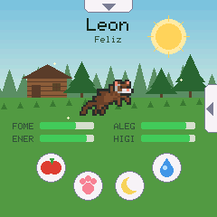 | 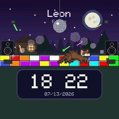 | 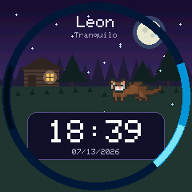 |

## Features

### 🦦 A living pet

Four stats (hunger, energy, joy, hygiene) decay over time; his mood shows in
the header and on the RGB LED. He wanders, jumps, eats, burrows into the
ground and sleeps — animated from an Aseprite sprite sheet
([by Elthen 🦦](#credits)). The forest follows the **real time of day** (NTP):
sunny day, golden sunset, and a starry night with a lit cabin window and
fireflies.

| Day | Golden hour | Night + idle clock | Config menu |
|---|---|---|---|
|  | 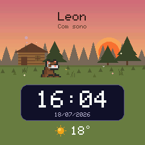 | 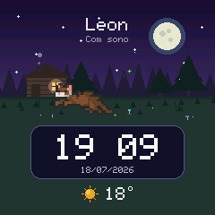 | 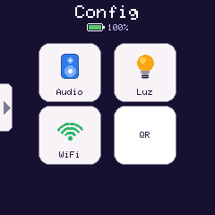 |

Leave him alone for a while and the HUD gives way to an **idle clock**
(NTP-synced, 12/24h, timezone auto-detected by the web portal).

### 🌦️ Real weather

The scene follows the **actual weather** at your place (free Open-Meteo API,
fetched by the firmware itself over verified TLS — no Home Assistant, no API
key). **Every WMO condition has its own look** — palette tint, cloud cover,
precipitation density and speed, and effects like visible lightning bolts
with a thunder clap, hail pellets and icy freezing-rain crystals. Ambient
sounds too: rain patter and forest wind, played sparsely and never over
other audio. **Swipe up from the bottom** for the forecast screen — today
big (icon, current temp, condition, hi/lo + humidity) plus the next four
days (icon, hi/lo, chance of rain). Set your city once in the web portal
(the browser does the geocoding search); if the HA integration is connected
it gifts the home location automatically.

<table>
<tr>
<td align="center">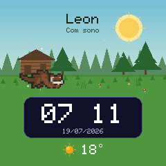<br><sub>Clear (0)</sub></td>
<td align="center">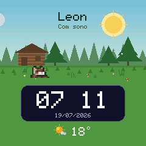<br><sub>Mainly clear (1)</sub></td>
<td align="center">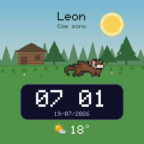<br><sub>Partly cloudy (2)</sub></td>
<td align="center">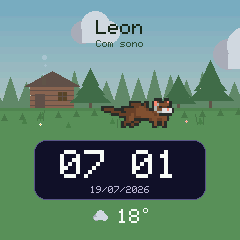<br><sub>Overcast (3)</sub></td>
<td align="center">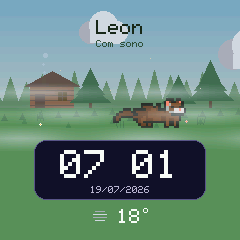<br><sub>Fog (45/48)</sub></td>
</tr>
<tr>
<td align="center">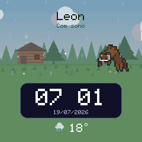<br><sub>Drizzle (51–55)</sub></td>
<td align="center">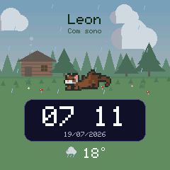<br><sub>Rain (61–65)</sub></td>
<td align="center">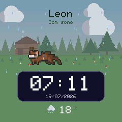<br><sub>Showers (80–82)</sub></td>
<td align="center">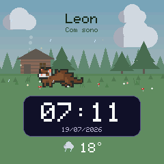<br><sub>Freezing rain (56/57/66/67)</sub></td>
<td align="center">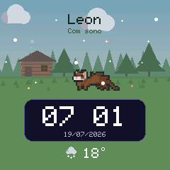<br><sub>Snow (71–75)</sub></td>
</tr>
<tr>
<td align="center">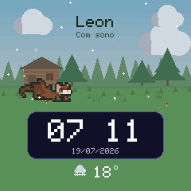<br><sub>Snow grains (77)</sub></td>
<td align="center">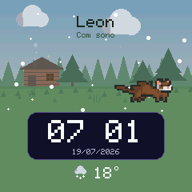<br><sub>Snow showers (85/86)</sub></td>
<td align="center">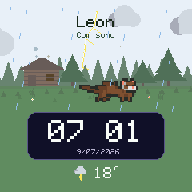<br><sub>Thunderstorm (95)</sub></td>
<td align="center">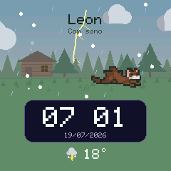<br><sub>Hail (96/99)</sub></td>
<td align="center">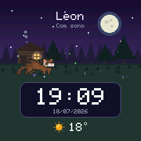<br><sub>Clear, at night ✨</sub></td>
</tr>
</table>

### 🎉 Festive dates & birthday

The forest dresses up for the calendar (real date over NTP), and each theme
coexists with the live weather:

- 🎄 **Christmas** (Dec 1–25): a decorated pine with baubles, a twinkling star
  and fairy lights matching the cabin's, gift boxes, a snowman, a door wreath,
  icicles and candy canes — and **Santa's sleigh flies across the sky** with a
  jolly *"ho ho ho"*.
- 🎃 **Halloween** (Oct 24–31): a graveyard (headstone, cross, skull), a
  bubbling cauldron glowing green with rising smoke and little pops, a carved
  jack-o'-lantern that lights up at night — and a **witch cackles past on her
  broom**, trailing green sparkles.
- 🌽 **Festa Junina** (Jun 12–24): flag garlands, a crackling bonfire, a
  striped food stall with a lit lamp, floating paper lanterns and corn stalks.
- 🎆 **New Year** (Dec 31 + Jan 1): fireworks bursting across the sky all day,
  and the barrage fires **right at the stroke of midnight**.
- 🎂 **Birthday**: on his birthday (set once in the portal or Home Assistant)
  he gets a cake with flickering candles, balloons drifting around, confetti and
  *"Parabéns pra Você"*.

The sleigh and the witch pass every so often at varied heights and directions,
always facing the way they fly, each with its own sound.

### 🎮 Three mini-games

Playable on the touch screen — or from your phone, with the web portal
acting as a game controller.

| Games menu | Jump! | Bolinha (fetch) | Genius |
|---|---|---|---|
| 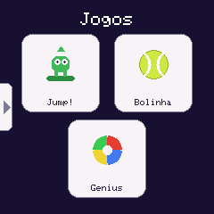 | 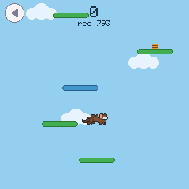 | 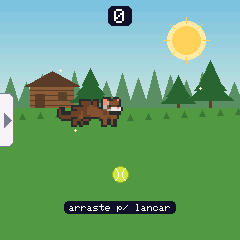 | 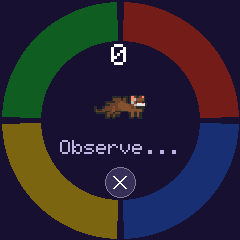 |

- **Jump!** — doodle-jump style: springs, moving and crumbling platforms,
  parallax clouds, NVS high score.
- **Bolinha** — fetch: throw the tennis ball with a swipe, the ferret chases
  it down with real physics and brings it back.
- **Genius** — Simon-says on the round bezel: four color arcs, the RGB LED
  and an authentic tone per color.

### 📱 Web portal (no app needed)

The device serves a React portal from flash at `http://critter.local` —
live stats over WebSocket, remote actions, settings, screenshots, and game
controllers. The centerpiece is a **live mirror of the actual screen**: the
firmware streams the real canvas (per-row delta encoding, ~20 fps) so you see
exactly what's on the device, weather, festive decorations and all.

And the mirror is a **remote control** — tap and swipe on it and the touches
are injected into the same input pipeline as the physical screen, so you can
pet the ferret, hit the action buttons, open the config menu, the "Casa"
panel, the weather screen, launch and even *steer the games* — everything,
right from your phone.

| Portal | As a game controller |
|---|---|
| 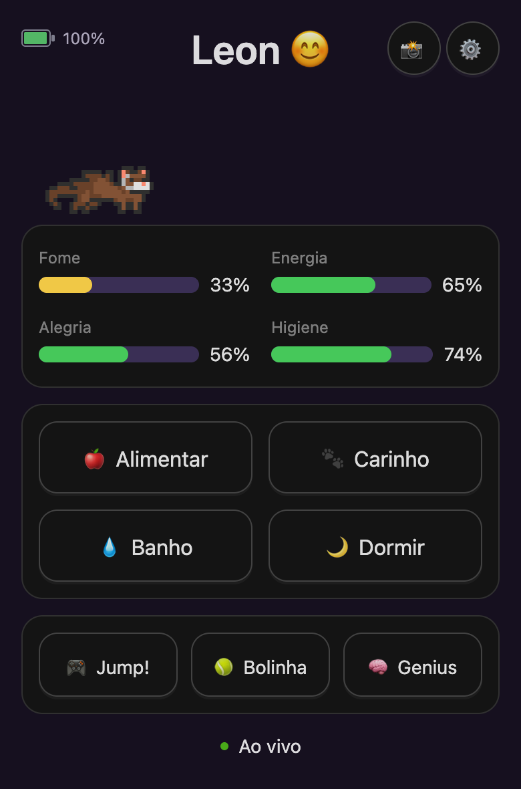 | 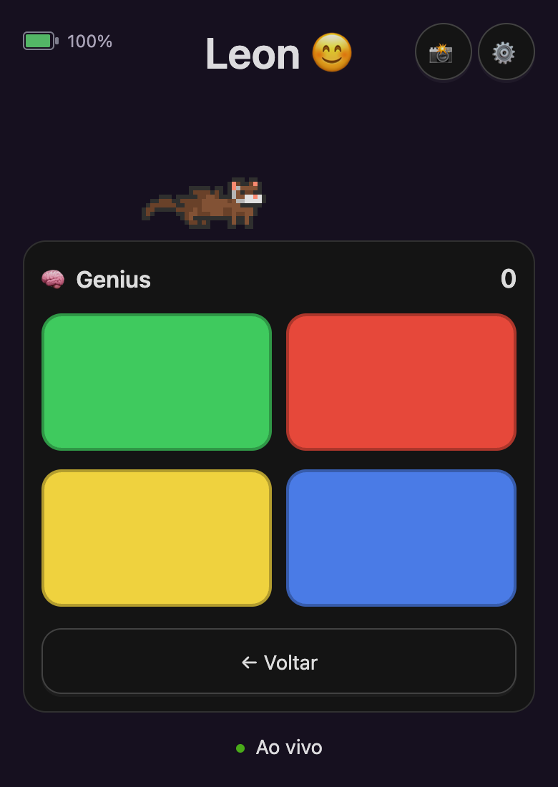 |

### 🔊 Media player

A Voice PE-style audio pipeline (network reader task → 1 MB PSRAM ring →
decoder) plays **FLAC / MP3 / WAV** over http — web radio, Home Assistant
TTS, Music Assistant tracks, and AirPlay (via Music Assistant's AirPlay
receiver). Format is auto-detected from the stream header.

And it's a show:

- 🪩 **Party mode** when music plays: forced night theme, mirrored disco
  ball, random laser pulses, a color-shifting dance floor, smoke machines,
  thumping speaker cabinets — the ferret dancing through all of it while the
  RGB LED **flashes to the actual beat** (live PCM envelope analysis).
- 🔵 **Voice rings** for the assistant (below).

### 🎙️ Voice assistant

**Just say "Alexa"** — always-on wake word, no button needed. The mic
(ES8311 ADC, 16 kHz) streams continuously to Home Assistant, where
openWakeWord (local, private) listens for the wake word; on a hit the
Assist pipeline takes over — STT, your conversation agent, and the spoken
reply plays back through the speaker. If the assistant answers with a
follow-up question, the mic reopens by itself so you can just reply. Every
phase gets its own ring around the round bezel, plus iOS-style earcons.
**Hold BOOT to push-to-talk** at any time (the button beats the wake word).

A **quick BOOT tap mutes the microphone** (Echo-style privacy: nothing
leaves the device — a hard gate at the source) — a crossed-mic icon shows
on screen. When the assistant can actually hear you (device streaming
*and* the HA pipeline confirmed it's consuming the audio), a small **cyan
mic** shows at the top; if the pipeline gets unstable it blinks — honest,
end-to-end status you can debug at a glance.

| Listening | Thinking | Speaking | Mic muted |
|---|---|---|---|
| 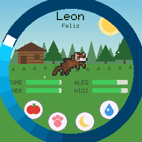 | 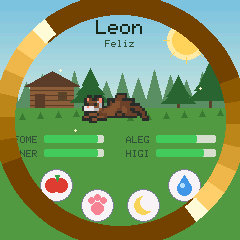 |  | 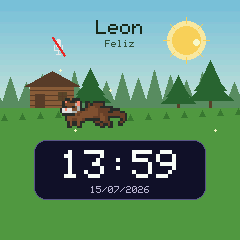 |

### 🔒 Pairing & security

TV-style pairing: when an app asks to connect, a **random 6-digit PIN pops
on the screen by itself**; typing it (portal OTP boxes / HA config flow)
hands the client a long-lived credential. Every WebSocket client must
authenticate before *anything* — state, commands and especially the mic —
and screenshots require the token too. The Security menu lists the devices
connected right now and can **revoke everyone** with a two-tap confirm
(clients re-pair by PIN; HA lands in its reauth flow automatically).

| Pairing PIN | Devices + revoke |
|---|---|
| 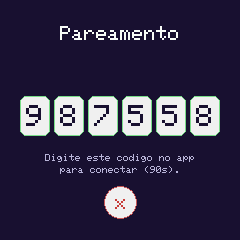 | 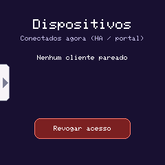 |

### 🏠 Home Assistant

With the [companion integration](https://github.com/HomeCritters/homecritters-ha-plugin)
(HACS): auto-discovery via zeroconf + PIN pairing, stat/mood/battery
sensors, action buttons, switches (sleep, **night mode** with configurable
sleep/wake sounds — great for schedule automations —, **microphone mute**,
idle clock), brightness sliders, every device setting (pet name, timezone,
time/date formats, timeouts) organized in Controls / Configuration /
Diagnostics sections, a `media_player` entity for TTS and Music Assistant
(set the player codec to **MP3 or FLAC** — ALAC is not supported) and an
`assist_satellite` with always-on wake word + push-to-talk voice.

There's also a **"Casa" panel on the device itself**: pull the left edge of
the pet screen to open a paginated grid of your HA entities — lights,
switches, fans and locks as one-tap toggles, temperature/humidity/
illuminance and presence sensors read-only. Pick (and drag-order) the
entities in the integration's Configure dialog.

## Hardware

Spotpear/Xiaozhi **Ball V2**:

| Part | Chip |
|---|---|
| MCU | ESP32-S3 (16 MB flash, 8 MB octal PSRAM) |
| Display | GC9A01 round 240×240, SPI |
| Touch | CST816 (dedicated I2C bus) |
| Audio | ES8311 codec + speaker amp, I2S |
| Extras | WS2812 RGB LED, battery ADC, BOOT button |

Full commented pinout in [`include/pins.h`](include/pins.h) (single source of
truth), based on [RealDeco/xiaozhi-esphome](https://github.com/RealDeco/xiaozhi-esphome).

> ⚠️ Hard-won lesson: route I2S **MCLK to GPIO16** (its real pin). The audio
> library's silent default (GPIO0) radiates an ~11 MHz clock next to the
> antenna and desenses WiFi whenever audio plays.

## Building & flashing

> 🆕 First time? Follow the full step-by-step install guide:
> **[docs/INSTALL.md](docs/INSTALL.md)** — from a brand-new Ball V2 to a
> paired portal (WiFi setup, PIN pairing, HA, second device).

```bash
pio run                 # build
pio run -t upload       # build and flash (USB-C; hold BOOT if no port shows up)
pio device monitor      # serial log, 115200 baud
```

First boot opens a **WiFi captive portal** (AP "HomeCritters") for network
setup. After that the device announces itself as `critter-XXYYZZ.local`
(unique per device).

## Regenerating assets

Assets are embedded as generated headers (no filesystem upload step):

```bash
# Ferret animation frames (from the Aseprite sheet in assets/)
python3 assets/aseprite_to_frames.py

# Sounds (any MP3 -> PROGMEM header)
python3 assets/mp3_to_header.py <file.mp3> <symbol> include/sounds/<name>.h

# Web portal (React) -> gzipped single file in flash
cd web && npm install && npm run build && cd ..
python3 assets/web_to_header.py
```

## Project layout

```
src/            firmware modules (Pet, Renderer, FerretActor, AudioPlayer,
                WebPortal, Clock, InputController, StatusLed, Battery, games)
src/audio/      media pipeline: AudioReader (esp_http_client) -> StreamRing
                (1MB PSRAM SPSC) -> decoder task
include/        pinout, game config, theme, UI layout + generated assets
assets/         sprite sheet + asset pipeline scripts
web/            React portal (Vite + Ant Design), embedded via web_index.h
tools/          hwshot.py (screen -> PNG over serial) + serial console
```

Code and comments are in English. UI strings are currently Portuguese (pt-BR)
only — **there is no i18n layer yet, and building one is an open invitation**;
see [Contributing](#contributing).

See [`CLAUDE.md`](CLAUDE.md) for full architecture notes — the module map, the
WebSocket protocol, and the hardware lessons learned the hard way.

## Credits

**The ferret is drawn by [Elthen's Pixel Art Shop](https://elthen.itch.io/).**
Every frame of him — walking, digging, sleeping, dancing — comes from
[**2D Pixel Art Ferret Sprites**](https://elthen.itch.io/2d-pixel-art-ferret-sprites).
This whole project exists because that sprite sheet was charming enough to
build a device around. If he makes you smile, go
[support the artist](https://www.patreon.com/elthen). 🦦

Sound effects come from [MyInstants](https://www.myinstants.com/) and friends —
credit to whoever made each *boing*.

Pinout reverse-engineering from
[RealDeco/xiaozhi-esphome](https://github.com/RealDeco/xiaozhi-esphome);
weather data from [Open-Meteo](https://open-meteo.com/); wake word by
[openWakeWord](https://github.com/dscripka/openWakeWord).

## Contributing

Bug reports, mini-games, weather effects and festive themes are all welcome —
start with [`CONTRIBUTING.md`](CONTRIBUTING.md). Please open an issue before
building anything large, screenshot any visual change (with the bezel ring),
and remember the house rule: **every new feature deserves a sound effect**.

Two things we'd particularly love help with (see [`TODO.md`](TODO.md)):

- 🌍 **Internationalisation.** Every UI string — on the device and in the web
  portal — is hardcoded in Portuguese today. There is no i18n layer at all, so
  someone gets to design one: a string table for the firmware (`PROGMEM`,
  language picked in the config menu and persisted in NVS) and a matching one
  for the React portal, with **English as the first translation**. Greenfield,
  self-contained, and it opens the project up to everyone.
- 🔊 **More sounds.** The house rule is that every feature deserves one, and
  there are always features without one yet.

Everyone taking part is expected to follow the
[Code of Conduct](CODE_OF_CONDUCT.md). Found a security problem? Don't open an
issue — see [`SECURITY.md`](SECURITY.md).

## License

[PolyForm Noncommercial 1.0.0](LICENSE) © HomeCritters.

In plain words: **use it, change it, share it, contribute back — just don't
sell it.** Build one for your desk, fork it, mod it, gift one to a friend;
any noncommercial purpose is fair game. Making money off it (selling devices,
selling the firmware, bundling it in a paid product) is not.

> Required Notice: Copyright HomeCritters
> (https://github.com/HomeCritters/homecritters-firmware)

The art, the sounds and the libraries belong to their own authors and keep
their own licenses — they're all listed in
[`THIRD_PARTY_NOTICES.md`](THIRD_PARTY_NOTICES.md).
